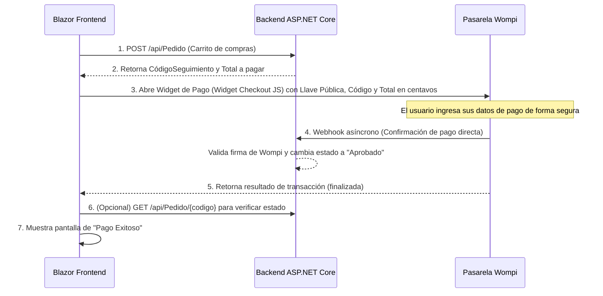

# Guía de Integración de Pasarela de Pagos (Wompi)

Esta guía documenta el flujo de integración de la pasarela de pagos **Wompi** en el frontend (Blazor WebAssembly) y su comunicación con la API del backend.

---

## 1. El Flujo de Trabajo (Paso a Paso)



1. **Creación del Pedido:** El usuario pulsa "Pagar". El frontend hace una petición POST a la API para registrar el pedido con estado `"Pendiente"`.
2. **Obtención de Datos:** La API responde con el `CodigoSeguimiento` (e.g. `PED-A7E1`) y el `Total` de la compra.
3. **Apertura de Wompi:** El frontend inicializa el Widget de Wompi pasando los datos de la compra.
4. **Validación del Pago:** El usuario paga dentro del modal de Wompi. Wompi le avisa directamente por debajo (Webhook) a la API del backend. La API valida la transacción y actualiza el pedido a `"Aprobado"`.
5. **Finalización en Frontend:** Cuando el Widget retorna el evento de éxito, el frontend muestra la pantalla de pago exitoso (opcionalmente consultando el estado actual del pedido en la API).

---

## 2. Parámetros Clave para el Widget de Wompi

Al abrir el modal de Wompi desde el frontend, se deben enviar obligatoriamente los siguientes datos:

| Parámetro | Nombre en Wompi | Descripción | Ejemplo |
| :--- | :--- | :--- | :--- |
| **Llave Pública** | `public-key` | Identificador de la cuenta receptora en Wompi. | `pub_test_Q5Yt...` |
| **Referencia** | `reference` | El **CódigoSeguimiento** del pedido. (Esencial para que el Webhook lo asocie en backend). | `"PED-A7E1"` |
| **Monto** | `amount-in-cents` | El total a pagar expresado **en centavos** (multiplicado por 100). | `$50.000 COP` $\rightarrow$ `5000000` |
| **Moneda** | `currency` | Tipo de moneda. | `"COP"` |

> [!WARNING]
> **Normativa PCI DSS:** Por seguridad, no crees formularios propios para capturar tarjetas de crédito. Utiliza siempre el Widget oficial o la redirección de Wompi.

---

## 3. Ejemplo de Integración en Blazor WebAssembly

### Paso A: Incluir el Script de Wompi
Añade la librería del widget en tu archivo de inicio HTML (`wwwroot/index.html`):
```html
<script type="text/javascript" src="https://checkout.wompi.co/widget.js"></script>
```

### Paso B: Crear Función Helper en Javascript
Crea un script helper (e.g. en `wwwroot/js/wompi-helper.js`) para manejar de forma dinámica el Widget programático:
```javascript
window.abrirWidgetWompi = function (publicKey, reference, amountInCents, redirectUrl) {
    var checkout = new WidgetCheckout({
        currency: 'COP',
        amountInCents: amountInCents,
        reference: reference,
        publicKey: publicKey,
        redirectUrl: redirectUrl
    });

    checkout.open(function (result) {
        var transaction = result.transaction;
        console.log('Transacción Finalizada. ID: ', transaction.id, ' Estado: ', transaction.status);
        // Aquí puedes ejecutar lógica adicional o redirecciones personalizadas
    });
};
```

### Paso C: Invocar desde el Componente de Blazor (C#)
Inyecta `IJSRuntime` en tu componente de Checkout e invoca la función cuando la API responda con el pedido creado:

```razor
@inject IJSRuntime JS
@inject ApiService ApiService
@inject NavigationManager Navigation

@code {
    private async Task ProcesarPago()
    {
        // 1. Registrar pedido pendiente en la API
        var pedidoResponse = await ApiService.CrearPedidoDesdeCarritoAsync(); 
        
        if (pedidoResponse != null)
        {
            string publicKey = "pub_test_LLAVE_PUBLICA_PROVISTA_POR_BACKEND";
            string reference = pedidoResponse.CodigoSeguimiento;
            
            // Wompi requiere el monto en centavos (ej: $58.000 COP -> 5800000 centavos)
            long amountInCents = (long)(pedidoResponse.Total * 100); 
            string redirectUrl = Navigation.ToAbsoluteUri("/pago-exitoso").ToString();

            // 2. Abrir modal seguro de Wompi
            await JS.InvokeVoidAsync("abrirWidgetWompi", publicKey, reference, amountInCents, redirectUrl);
        }
    }
}
```
